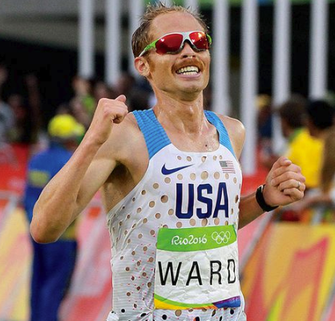
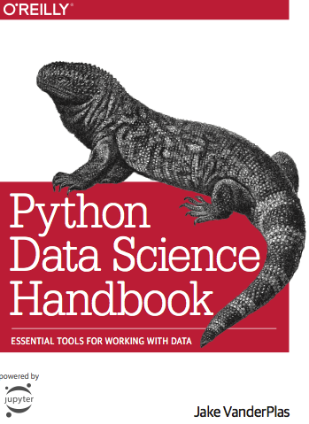

```{r setup, include=FALSE}
knitr::opts_chunk$set(warning = FALSE, message = FALSE)
options(htmltools.dir.version = FALSE)

library(xtable)
library(geepack)
library(MASS)
library(car)
library(summarytools)
library(tidyverse)

df <- read_tsv("data/marathon_wide.tsv")
```
# Marathons?
.footnote[
\* Figures courtesy of [Running USA](https://www.runningusa.org/RUSA/Research/Recent_Reports/Marathon_Report/RUSA/Research/Recent_Reports/Marathon_Report.aspx)
]

* Foot races of 26.2 miles (~42.2km)
* Emerged in tandem with the modern olympics

.center[Estimated U.S. Marathon Finishers\*]

|Year|Number of Finishers|
|:-:|:-:|
|2013|541,000|
|2014|550,600|
|2015|509,000|
|2016|507,600|


* Various goals, but generally looking to improve

???
Inauguration in the modern Olympics. 

Each year hundreds of thousands of participants complete marathons across the United States. 

While goals for competitors differ, desire to improve across marathoners seems prevalent.

---

# Optimizing Race Performance

* Influenced by a number of factors

  * Nutrition
  * Training
  * Running Mechanics and Energy Cost
  * Pacing Strategy
  
--

* Expanding interest motivated scientific study
  * Focus moreso on Nutrition, Training, and Running Mechanics

---

# Pacing Strategy

* Can make or break a performance

* Conventional wisdom: even pacing is better
  * Alternatives: negative split; positive split

--
  
### Open Questions

1. What does the pacing profile of an average runner look like?

2. How do pacing profiles vary amongst:

    * Different levels of performances ("elites" versus avergage; Boston qualifiers versus non-qualifiers?)

    * Age

    * Gender
    
    * Different Races

---
# Inspiration for this work

.center[

]

--

.center[

]

---

count: false

# Inspiration for this work

.center[

]

* ~5000 Participants

* Times at 3 intermediate checkpoints + finishing time

---
count:false
# Inspiration for this work

.center[

]


$$y \sim \textrm{MVN}(X\beta, \Sigma)$$
$$\beta | \Sigma \sim \textrm{MVN}(\hat{\beta}, \Sigma \otimes (X^TX)^{-1})$$
$$\Sigma \sim \textrm{InvWishart}(n,S)$$
$$S = (y - x\beta)^T(y - x\beta) + (\beta - \hat{\beta})^T(X^TX)(\beta - \hat{\beta})$$

---
# Data



* Marathon times from 37,250 runners

  * Age, Gender, Half Split, Finish Time
  
  * Courtesy of [Jake VanderPlas](http://vanderplas.com/)
  
* Additional Computed Variables

  * Second half split
  
  * Pace (full, each half)
  
  * Relative Pace
    * First and Second Half over Full
  
  * BQ
  
  * Top 10%

---

# Data Summary

```{r echo=FALSE, message=FALSE, warning=FALSE, results='asis'}
#freq(df$BQ, style = "rmarkdown", omit.headings = TRUE, report.nas = FALSE)
```

### Gender

|    *Gender* |  Freq |      % |
|----------:|------:|-------:|
|     **M** | 24665 |  66.21 |
|     **W** | 12585 |  33.79 |
| **Total** | 37250 | 100.00 |


### Boston Qualifiers


| Boston Qualifier? |  Freq |      % |
|----------:|------:|-------:|
|     **No** | 34073 |  91.47 |
|     **Yes** |  3177 |   8.53 |
| **Total** | 37250 | 100.00 |


---

# Boston Qualifiers by Gender

```{r echo=FALSE, message=FALSE, warning=FALSE}
with(df, print(ctable(gender, BQ, omit.headings = TRUE), method = 'render', footnote = ""))
```

---
class: center, middle, inverse

# Age

```{r echo=FALSE, message=FALSE, warning=FALSE}
df %>% ggplot(aes(x = age)) + geom_histogram(binwidth = 4) + xlab("Age") + ggtitle("Distribution of Ages")
```


---
class: center, middle, inverse

# Overall Time

```{r echo=FALSE, message=FALSE, warning=FALSE}
df %>% ggplot(aes(x = fullPace)) + geom_histogram()  +
  scale_x_continuous(name = "Full Time (pace/mile)", breaks = c(250, 500, 750, 1000, 1250), 
                     labels = c("1:49:10 (4:10)", "3:38:20 (8:20)", "5:27:30 (12:30)", "7:16:40 (16:40)", "9:05:50 (20:50)")) +
  ylab("Frequency") + ggtitle("Marathon Times")
```

---
class: center, middle, inverse

# Stratified by Gender

```{r echo=FALSE, message=FALSE, warning=FALSE}
df %>% ggplot(aes(x = fullPace, fill = factor(gender))) + geom_histogram(alpha=0.2, position="identity")  +
  scale_x_continuous(name = "Full Time (pace/mile)", breaks = c(250, 500, 750, 1000, 1250), 
                     labels = c("1:49:10 (4:10)", "3:38:20 (8:20)", "5:27:30 (12:30)", "7:16:40 (16:40)", "9:05:50 (20:50)")) +
                      ylab("Frequency") + ggtitle("Marathon Times by Gender") + guides(fill=guide_legend(title="Gender"))
```

---
class: center, middle, inverse

## First Half Pace Relative to Overall
```{r echo=FALSE, message=FALSE, paged.print=FALSE}
df_tall <- df %>% dplyr::select(ID, ageN, gender, BQ, top10Q, fullPace, halfPace, secondHalfPace) %>%
  gather(segment, pace, halfPace:secondHalfPace)

df_tall['rel_pace'] <- df_tall$pace / df_tall$fullPace
df_tall %>% filter(segment == "halfPace") %>% ggplot(aes(x = rel_pace)) + geom_histogram() +
  xlab("First Half Pace / Overall Pace") + ylab("Frequency")
```

---
class:center, middle, inverse

## Second Half Pace Relative to Overall
```{r echo=FALSE, message=FALSE, paged.print=FALSE}
df_tall %>% filter(segment == "secondHalfPace") %>% ggplot(aes(x = rel_pace)) + geom_histogram() +
  xlab("Second Half Pace / Overall Pace") + ylab("Frequency")
```

---
class: center, middle, inverse

## Second Half Pace Relative to Overall (By Gender)

```{r echo=FALSE, message=FALSE, warning=FALSE}
df_tall %>% filter(segment == "secondHalfPace") %>% ggplot(aes(x = rel_pace, fill = gender)) + 
  geom_histogram(alpha=0.2, position="identity") +
  xlab("Second Half Pace / Overall Pace") + ylab("Frequency")
```


---

class: inverse, center, middle

# Let's Fit Some Models!

---

# GEE? (This is EE, after all)

$$log(y_{i,t}) = \alpha + X\beta $$
$$y_{i,t} = (\frac{\textrm{pace for half t}}{\textrm{overall pace}})_i$$

### Covariates
* Age (standardized)
* Gender
* BQ?
* Which segment (first or second)
* Top 10%?

---
```{r model1, message=FALSE, warning=FALSE, results='asis', cache=TRUE}
df_tall['RelPace'] <- df_tall$pace / df_tall$fullPace
fit1 <- geeglm(RelPace ~ ageN + factor(gender) + factor(BQ) + factor(segment) + factor(top10Q),
               family = gaussian(link = "identity"), data = df_tall, id = ID, corstr = "exchangeable")
print(xtable(fit1), type = "html")
```
---
```{r model2, message=FALSE, warning=FALSE, results='asis', cache=TRUE}
df_tall['RelPace'] <- df_tall$pace / df_tall$fullPace
fit2 <- geeglm(RelPace ~ ageN + factor(gender) + factor(BQ) + factor(segment) + factor(top10Q),
               family = gaussian(link = "log"), data = df_tall, id = ID, corstr = "exchangeable")
print(xtable(fit2), type = "html")
```
---
```{r message=FALSE, warning=FALSE, include=FALSE}
df['relDiff'] <- df$diffPace / df$fullPace
```

```{r model3, results='asis'}
fit3 <- lm(relDiff ~ ageN + factor(gender) + factor(BQ) + factor(top10Q), data = df)
print(xtable(fit3), type = "html")
```

---

```{r model4, results='asis'}
fit4 <- lm(relDiff ~ ageN * factor(gender) + factor(BQ) + factor(top10Q), data = df)
print(xtable(fit4), type = "html")
```
---
class: center, middle
```{r qqplot, echo=FALSE, message=FALSE, warning=FALSE, cache=TRUE}
qqPlot(fit4, main="QQ Plot")
```

---
# Robust Linear Regression (IRLS)

```{r model5, results='asis'}
fit5 <- rlm(diffPace ~ ageN * factor(gender) + factor(BQ) + factor(top10Q), data = df)
knitr::kable(summary(fit5)$coefficients, format="html")
```

---
class: inverse, center, middle

# Future Work

---

# Race-level Effects

### Including data from more than one race

### Potential Difficulties

* Different intermediate time points

  * Frame as a missing data problem? 

* Same individual appearing in more than one race

* How to include information without knowing which race(s?) data comes from? 

---
class: inverse, center, middle
# Thanks!
## Slides, code, data available on github
[https://github.com/theandyb/830project](https://github.com/theandyb/830project)

